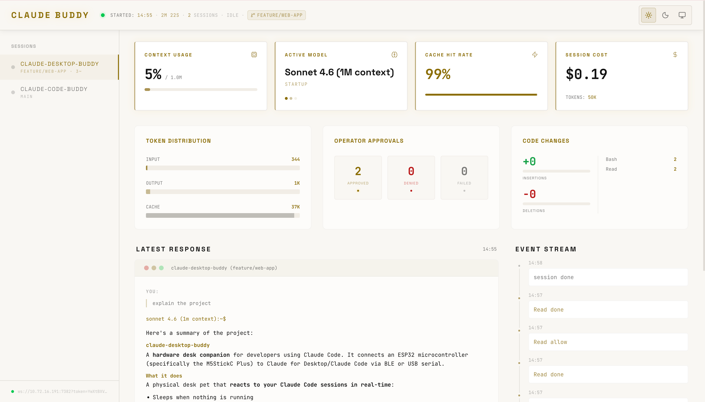
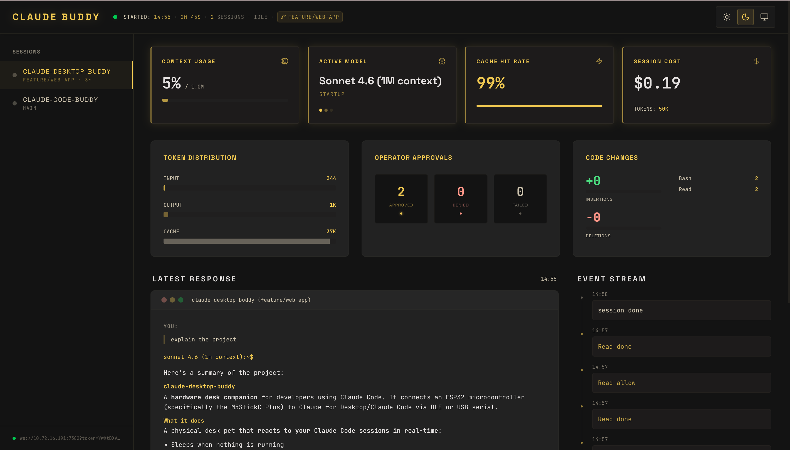
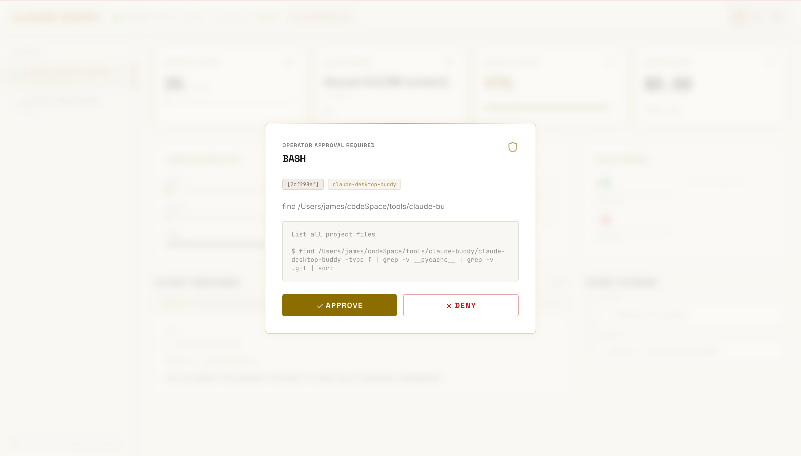
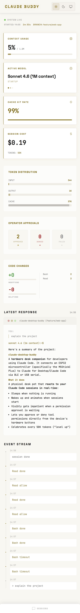
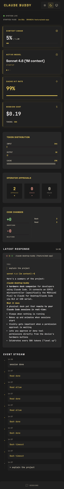
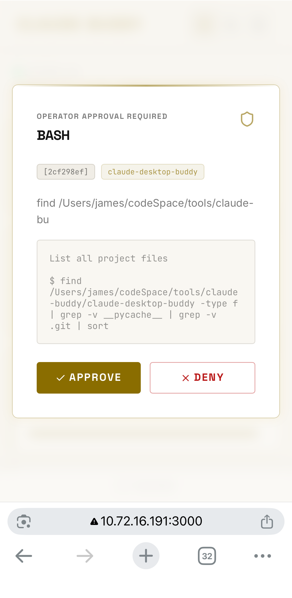

# claude-code-buddy

Real-time dashboard and optional hardware display for monitoring Claude Code sessions. Claude Code hooks POST events to a local Python hub; the hub pushes live heartbeat snapshots over WebSocket to a Next.js web UI (and optionally to a serial or BLE hardware device). The UI lets you approve or deny tool calls remotely, including from your phone on the same LAN.

[简体中文](README.zh-CN.md) | [繁體中文](README.zh-TW.md)

## Demo

[](https://youtu.be/SEFFsbFHAD8)

## Screenshots

**Desktop**

<table>
  <tr>
    <td></td>
    <td></td>
  </tr>
  <tr>
    <td align="center"><sub>Light mode</sub></td>
    <td align="center"><sub>Dark mode</sub></td>
  </tr>
</table>


**Mobile**

<table>
  <tr>
    <td></td>
    <td></td>
    <td></td>
  </tr>
  <tr>
    <td align="center"><sub>Light</sub></td>
    <td align="center"><sub>Dark</sub></td>
    <td align="center"><sub>Approval</sub></td>
  </tr>
</table>

## Features

- Real-time session monitoring — status, model, context usage, heartbeat updates on every hook.
- Remote approval UI — approve or deny `PreToolUse` prompts from the browser, desktop or phone.
- Multi-session support — several concurrent Claude Code sessions share one dashboard; sidebar lists up to 5.
- Token usage and cost tracking — input / output / cache breakdown with per-model USD pricing.
- Git state per session — current branch, dirty file count, committed and uncommitted line diff.
- Event stream timeline — chronological hook events for the focused session, colour-coded.
- Optional hardware display — push the same snapshot to a serial or BLE Nordic UART device.

## Architecture

```
  Claude Code                Python hub                   Next.js frontend
  (hooks)                    (BuddyHub)                   (Bun dev server)
  ──────────                 ──────────                   ────────────────
       │                          │                             │
       │  POST /hook              │                             │
       │  127.0.0.1:7381          │                             │
       ├─────────────────────────▶│                             │
       │                          │  WebSocket                  │
       │                          │  :7382                      │
       │                          ├────────────────────────────▶│  ◀── Browser
       │                          │                             │      (desktop / phone
       │                          │  Serial / BLE (optional)    │       on the same LAN)
       │                          ├──▶  Hardware display        │
```

Every heartbeat is a full JSON snapshot of the focused session — see [DASHBOARD.md](DASHBOARD.md) for the complete data-lineage reference.

## Prerequisites

- Python 3.11 or newer, with [`uv`](https://docs.astral.sh/uv/) installed.
- [Bun](https://bun.sh) 1.x, or Node.js 20 or newer.
- Claude Code installed and runnable from your shell.

## Install

```bash
git clone https://github.com/<your-fork>/claude-code-buddy.git
cd claude-code-buddy/server/python && uv sync
cd ../../web && bun install
```

## Wire Up Claude Code

### 1. Hook events

Merge the `hooks` block from [`hooks/settings.json`](hooks/settings.json) into your `~/.claude/settings.json`.

Every hook posts the Claude Code payload to `http://127.0.0.1:7381/hook`. The trailing `|| echo '{}'` keeps Claude Code working when the hub is offline — a failed curl returns an empty JSON object to the hook runner instead of blocking the session.

### 2. Statusline (context %, cost, token counts, lines changed)

The rich metrics shown in the dashboard — context usage percentage, session cost, cumulative token counts, and code-change lines — come from Claude Code's `statusLine` mechanism, **not** from the hooks above. Configure it by adding a `statusLine` block to `~/.claude/settings.json` alongside the hooks:

```jsonc
// ~/.claude/settings.json
{
  "hooks": { /* ... from hooks/settings.json ... */ },
  "statusLine": {
    "type": "command",
    "command": "/absolute/path/to/claude-code-buddy/hooks/statusline.sh",
    "padding": 0
  }
}
```

[`hooks/statusline.sh`](hooks/statusline.sh) is a minimal script that reads the payload from stdin, forwards it to the hub in the background, and outputs a compact `🤖 Model · 🧠 N% · 💰 $0.00` status line in the terminal. Requires `jq` (`brew install jq`) for the terminal output; the hub forwarding works without it.

**Already have a custom statusline script?** Add these three lines immediately after your `INPUT=$(cat)` read:

```bash
INPUT=$(cat)

# claude-code-buddy: forward payload to hub
echo "$INPUT" | curl -sS --max-time 3 -X POST --data-binary @- \
  http://127.0.0.1:7381/hook >/dev/null 2>&1 &
```

## Run

| Scenario        | Hub command                                             | Frontend command | URL to open                        |
|-----------------|---------------------------------------------------------|------------------|------------------------------------|
| Local only      | `uv run python -m hub`                                  | `bun run dev`    | `http://localhost:3000`            |
| LAN + token     | `uv run python -m hub --host 0.0.0.0`                   | `bun run dev`    | Copy URL from the hub banner       |
| LAN, no auth    | `uv run python -m hub --host 0.0.0.0 --no-auth`         | `bun run dev`    | `http://<LAN-IP>:3000`             |

Run the hub from `server/python/` and the frontend from `web/`. The hub prints a copy-paste access banner on stderr, for example:

```
  Access:
    http://localhost:3000?token=abc…
    http://192.168.1.42:3000?token=abc…

  WebSocket token: abc…
  (stored at /Users/you/.config/claude-buddy/token)
```

The token is persisted to `~/.config/claude-buddy/token` with mode `0600`, so bookmarks survive hub restarts. Rotate it by passing a bare `--token` (generates a fresh one and overwrites the file), or use `--token VALUE` for a one-off run that leaves the file untouched.

## Access From Your Phone

1. On the computer: `uv run python -m hub --host 0.0.0.0`.
2. Put the phone and the computer on the same Wi-Fi.
3. Copy one of the `http://<LAN-IP>:3000?token=…` URLs from the hub banner and paste it into the phone browser.

If the UI shows a red **Unauthorized** banner, the token in the URL does not match the hub — copy the full URL from the banner again.

## CLI Options

| Flag            | Default        | Description                                                                                           |
|-----------------|----------------|-------------------------------------------------------------------------------------------------------|
| `--host`        | `127.0.0.1`    | WebSocket bind address. `0.0.0.0` exposes the hub on the LAN and requires a token unless `--no-auth`. |
| `--port`        | `7381`         | HTTP hook listener port. Always bound to `127.0.0.1` regardless of `--host`.                          |
| `--ws-port`     | `7382`         | WebSocket push port.                                                                                  |
| `--token`       | _(auto)_       | Bare `--token` rotates the persisted token. `--token VALUE` uses VALUE for this run only. Ignored on loopback binds. |
| `--no-auth`     | off            | Disable token auth even on a LAN bind. Use on trusted networks only.                                  |
| `--budget`      | `200000`       | Context-window token budget for the progress bar. `0` hides the bar.                                  |
| `--owner`       | `$USER`        | Owner name shown in the dashboard header.                                                             |
| `--transport`   | `auto`         | Hardware transport: `auto`, `serial`, `ble`, or `none`.                                               |
| `--serial-port` | _(none)_       | Explicit serial device path; overrides `--transport`.                                                 |

## Dashboard Overview

The UI is driven by a single JSON heartbeat per update. High-level components:

- **Header** — connection dot, session start time, live timer, session count, status badge, current branch. Source: `started_at`, `started_ts`, `running`, `branch`.
- **Sidebar** — up to 5 sessions, each with project name, branch, dirty count, status dot. Click to focus. Source: `hb.sessions[]`.
- **Stat cards** — Context Usage (`tokens` / `budget`), Active Model (`model`, `source`), Cache Hit Rate (`cache_pct`), Session Cost (`cost_usd`, `tokens`).
- **Metric panels** — Token Distribution (`input_tokens` / `output_tokens` / `cache_tokens`), Operator Approvals (`approvals`, `denials`, `fail_count`), Code Changes (`lines_added`, `lines_removed`, `tool_counts`).
- **Latest Response** — terminal-style panel with user question (`human_msg`) and assistant reply (`assistant_msg`) for the focused session.
- **Event Stream** — timeline of hook events for the focused session (`entries`).
- **Approval Modal** — full-screen overlay shown while a `PreToolUse` hook is waiting. Buttons emit `{cmd: "approve" | "deny" | "option", id}` over the same WebSocket.

See [DASHBOARD.md](DASHBOARD.md) for the full data-lineage reference — every field, its hub source, and how the frontend derives the displayed value.

## Troubleshooting

- **Next.js says "Blocked cross-origin request to Next.js dev resource"** — `next.config.ts` auto-includes every non-internal IPv4 at startup. Restart `bun run dev` after changing networks so it repicks the current IP.
- **Chrome forces HTTPS on a LAN IP** — type `http://` explicitly in the address bar, or visit `chrome://net-internals/#hsts` and delete the IP under **Delete domain security policies**.
- **Phone shows "Disconnected"** — check the banner: the WebSocket URL must point to your LAN IP, not `localhost`. Open the URL from the banner rather than typing one by hand.
- **Token unchanged after restarting the hub** — that is deliberate. Pass a bare `--token` on startup to rotate it, or delete `~/.config/claude-buddy/token` by hand.

## Development

```bash
# Python hub — syntax-check after every change
cd server/python
uv run python -m py_compile hub/*.py

# Frontend
cd web
bun run build
```

See [AGENTS.md](AGENTS.md) for the full set of coding rules and [CLAUDE.md](CLAUDE.md) for Claude Code specifics.

## License

MIT
